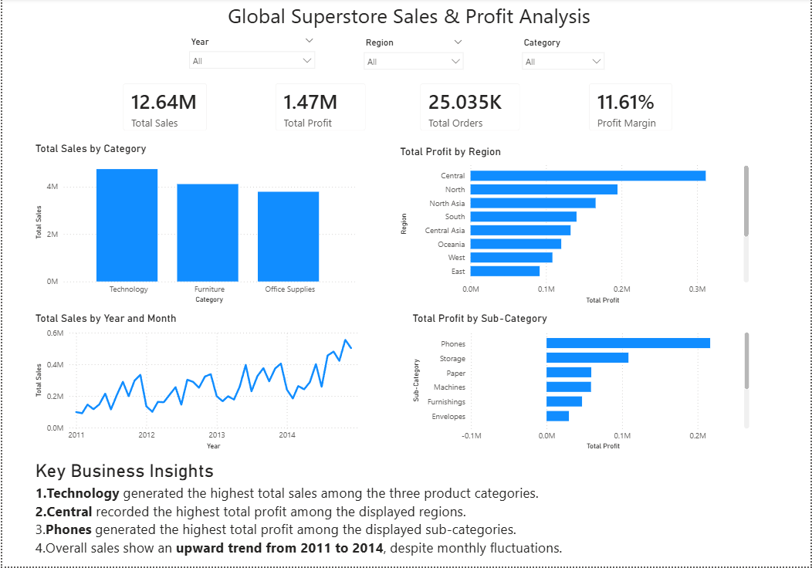

# Global Superstore Sales & Profit Analysis

## Overview

An interactive Power BI dashboard built using the Global Superstore dataset to analyze sales performance, profitability, regional performance, product categories, and sales trends.

## Tools Used

- Power BI
- Power Query
- DAX
- CSV

## Dashboard

## Key Business Insights

- Technology generated the highest total sales among the three product categories.
- Central recorded the highest total profit among the displayed regions.
- Phones generated the highest total profit among the displayed sub-categories.
- Overall sales showed an upward trend from 2011 to 2014 despite monthly fluctuations.

## Key Metrics

- Total Sales: 12.64M
- Total Profit: 1.47M
- Total Orders: 25.035K
- Profit Margin: 11.61%

## Power BI Features Used

- Power Query for basic data preparation
- DAX measures
- KPI cards
- Interactive slicers
- Category and regional analysis
- Time-series analysis
- Sub-category profitability analysis